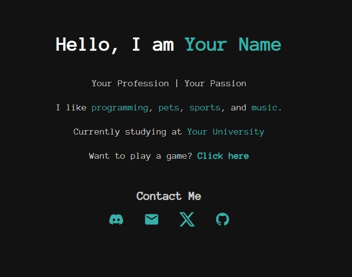

# Web Portfolio Template

Welcome to my Web Portfolio Template! This is a simple, modern portfolio template designed with a dark theme and a focus on readability. It is responsive and optimized for desktop and mobile devices. This template uses HTML, CSS, and includes smooth hover animations for a polished user experience.

## Features
- **Modern Design**: Clean, dark-themed interface.
- **Responsive**: Optimized for both desktop and mobile screens.
- **Hover Effects**: Interactive elements with smooth hover effects.
- **Social Media Icons**: Links to social media profiles.
- **Fun Text Effects**: Hover effects with dynamic text and color transitions.

## Screenshot
Below is a screenshot of the template in use:



## Getting Started

To use this template, follow the steps below:

### 1. Clone the Repository

To get started with this template, clone the repository to your local machine:

```bash
git clone https://github.com/JakubSdf/web-portfolio-template.git
```

### 2. Open the Files

Once cloned, navigate to the directory where the files are located, and open `index.html` in your preferred web browser to view the portfolio.

### 3. Customize

- **Personal Info**: Edit the `index.html` to update your name, bio, and other personal information.
- **Social Media Links**: Replace the social media links in the `.social-icons` section with your own.
- **Fun Text**: Customize the `.fun-text` in the CSS file to add your own interactive text.

### 4. Modify Styles

You can adjust the `style.css` file to change colors, fonts, and layout according to your personal preferences.

### 5. Deploy

You can deploy this template to any web hosting platform, such as GitHub Pages, Netlify, or Vercel.

## File Structure

```bash
/web-portfolio-template
│
├── index.html      # Main HTML file
├── style.css       # Main CSS file
└── screenshot.png  # Screenshot image of the portfolio
```

## License

This project is open-source and available for everyone.